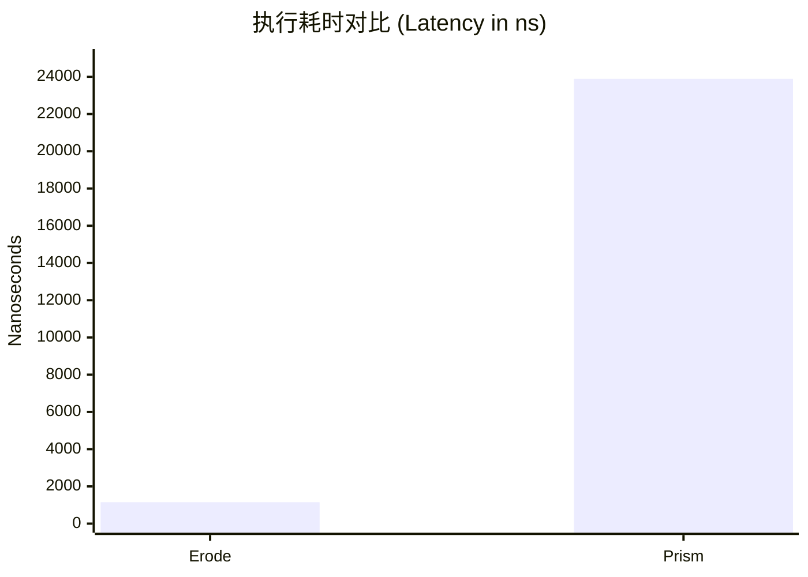
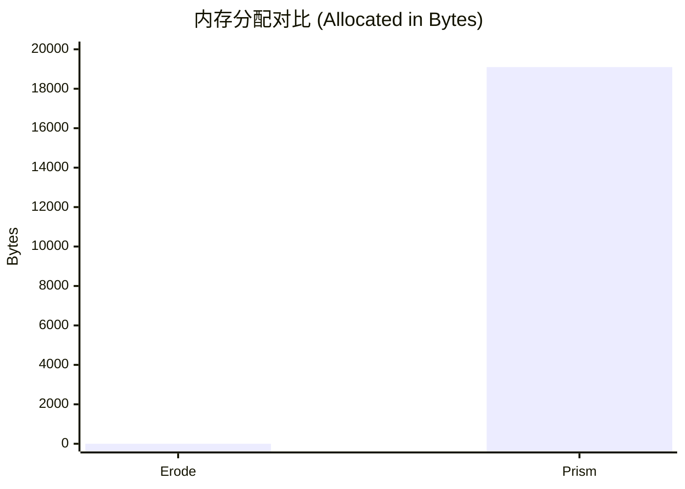
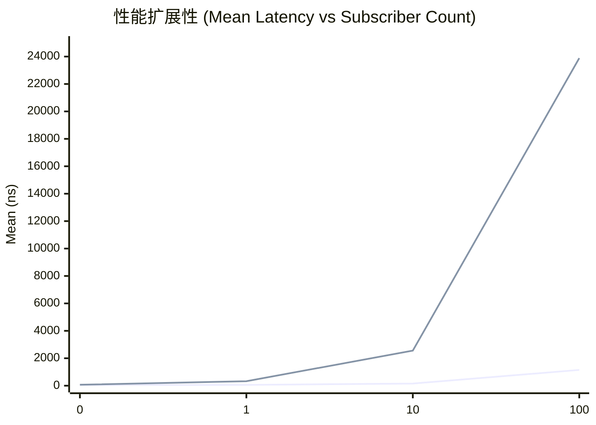

# Erode

**Zero-GC 高性能 类型安全 线程安全 自动生成事件类的事件系统**

[](https://dotnet.microsoft.com/)
[](https://www.nuget.org/packages/XXX)
[](LICENSE)

[English](README.en.md) | 中文

---

## 为什么选择 Erode

### 传统事件系统的问题

传统的 C# 事件系统存在以下问题：

- **需要手动定义事件类** - 每个事件都需要手动创建类，代码重复且容易出错
- **GC 压力** - 事件对象在堆上分配，频繁发布会产生 GC 压力
- **类型不安全** - 使用 `object` 或字符串作为事件类型，容易在运行时出错
- **性能开销** - 事件传递可能涉及装箱、拆箱或结构体复制

### Erode 的优势

- ✅ **告别手写事件类** - 只需定义接口，Source Generator 自动生成所有代码
- ✅ **零 GC 压力** - 使用 `record struct` 和 `in` 参数，发布操作零分配
- ✅ **零拷贝传递** - `in` 关键字实现按引用传递，即使大型事件对象也只需 O(1) 开销
- ✅ **编译时类型安全** - 强类型检查，IDE 智能提示，避免运行时错误
- ✅ **线程安全（框架级）** - 订阅/取消订阅/发布过程在框架层面线程安全（Copy-On-Write + 最小锁），订阅者回调的线程安全由用户保证
- ✅ **零运行时开销** - 编译时代码生成，运行时无反射、无字典查找

### 适用场景

- 🎮 **游戏开发** - 需要高频事件发布，对 GC 敏感
- 📊 **实时数据处理** - 大量事件流处理，需要低延迟
- 🔄 **事件驱动架构** - 需要类型安全的事件系统
- ⚡ **高性能应用** - 对性能有极致要求的场景

---

## 快速开始

### 安装

**IDE 要求**：请确保使用 Visual Studio 2022 17.8+ 或 JetBrains Rider 2023.3+。旧版 IDE 对 Source Generator 的支持不完善，可能无法正确识别生成的代码。

通过 NuGet 安装 Erode 包：

```bash
dotnet add package Erode
```

### 基本使用

#### 1. 定义事件接口

在项目的任意位置创建一个接口文件（例如 `IPlayerEvents.cs`），这个接口文件仅作为 Source Generator 的源文件，用于生成实际的事件代码。

接口命名规则：
- 接口名以 `I` 开头且第二个字母是大写时，生成的静态类名会移除首字母 `I`
  - 例如：`IPlayerEvents` → 生成 `PlayerEvents` 静态类
  - 例如：`IGameEvents` → 生成 `GameEvents` 静态类
- 否则直接使用接口名作为静态类名

```csharp
using Erode;

public interface IPlayerEvents
{
    [GenerateEvent]
    void PublishPlayerMovedEvent(int x, int y);
}
```

#### 2. 编译后自动生成

编译后，Source Generator 会自动生成：
- **事件类**：`PlayerMovedEvent`（`record struct`，实现 `IEvent` 接口）
- **静态类**：`PlayerEvents`（从接口名 `IPlayerEvents` 自动提取）
- **发布方法**：`PlayerEvents.PublishPlayerMovedEvent(x, y)`
- **订阅方法**：`PlayerEvents.SubscribePlayerMovedEvent(handler)`

**零拷贝设计**：
- 事件类使用 `record struct`（值类型），避免堆分配
- 回调使用 `InAction<T>` 委托，通过 `in` 关键字传递参数
- `in` 关键字实现**零拷贝传递**：事件对象按引用传递，但保证只读，无需复制整个结构体
- 这是实现零 GC 和零拷贝的关键设计

生成的代码位于 `obj` 目录下的 `.g.cs` 文件中，无需手动查看或修改。

#### 3. 订阅事件

**重要提示**：`PlayerMovedEvent` 和 `PlayerEvents` 都是编译时自动生成的类型，需要先编译一次项目后才能在代码中使用。首次创建接口文件后，请先执行编译（`dotnet build` 或在 IDE 中构建项目），然后再编写订阅和发布的代码。

**性能提示**：注意回调参数使用 `in` 关键字。`InAction<T>` 委托通过 `in` 参数传递事件对象，实现零拷贝：
- `in` 参数按引用传递，不复制整个结构体
- `in` 参数保证只读，编译器会阻止修改
- 即使事件对象包含大量字段，传递开销也是 O(1)，而非 O(n)

```csharp
var handler = new InAction<PlayerMovedEvent>((in PlayerMovedEvent evt) =>
{
    // 注意：evt 参数使用 in 关键字，零拷贝传递
    // 可以读取 evt.X 和 evt.Y，但不能修改 evt（编译器会阻止）
    Console.WriteLine($"Player moved to ({evt.X}, {evt.Y})");
});

var token = PlayerEvents.SubscribePlayerMovedEvent(handler);
```

#### 4. 发布事件

```csharp
PlayerEvents.PublishPlayerMovedEvent(10, 20);
```

#### 5. 取消订阅

```csharp
token.Dispose(); // 或使用 token.Unsubscribe()
```

---

## 使用示例

### 多事件接口

```csharp
public interface IGameEvents
{
    [GenerateEvent]
    void PublishPlayerJoinedEvent(string playerName);
    
    [GenerateEvent]
    void PublishPlayerLeftEvent(string playerName);
    
    [GenerateEvent]
    void PublishScoreUpdatedEvent(int score);
}

// 使用
GameEvents.PublishPlayerJoinedEvent("Alice");
GameEvents.PublishPlayerLeftEvent("Bob");
GameEvents.PublishScoreUpdatedEvent(100);
```

### 无参数事件

```csharp
public interface IApplicationEvents
{
    [GenerateEvent]
    void PublishApplicationStartedEvent();
}

// 使用
ApplicationEvents.PublishApplicationStartedEvent();
```

### 异常处理

```csharp
// 设置全局异常处理
EventDispatcher.OnException = (evt, handler, ex) =>
{
    Console.WriteLine($"Exception in handler: {ex.Message}");
};

// 或为特定事件类设置异常处理
PlayerEvents.OnException = (evt, handler, ex) =>
{
    // 处理 PlayerEvents 相关的异常
};

// 发布时异常不会抛出，所有 handler 都会被调用
PlayerEvents.PublishPlayerMovedEvent(10, 20);
```

### 多个订阅者

```csharp
var handler1 = new InAction<PlayerMovedEvent>((in PlayerMovedEvent evt) => 
{
    Console.WriteLine($"Handler 1: {evt.X}, {evt.Y}");
});

var handler2 = new InAction<PlayerMovedEvent>((in PlayerMovedEvent evt) => 
{
    Console.WriteLine($"Handler 2: {evt.X}, {evt.Y}");
});

var token1 = PlayerEvents.SubscribePlayerMovedEvent(handler1);
var token2 = PlayerEvents.SubscribePlayerMovedEvent(handler2);

// 发布一次，所有订阅者都会收到
PlayerEvents.PublishPlayerMovedEvent(10, 20);
// 输出:
// Handler 1: 10, 20
// Handler 2: 10, 20
```

---

## 性能

核心性能对比 (100 Subscribers)



---

## 要求

- .NET 8.0 或更高版本
- C# 12.0 或更高版本（用于集合表达式和 primary constructor）
- **IDE 支持**：
  - Visual Studio 2022 17.8+ 或
  - JetBrains Rider 2023.3+
  
  > **注意**：Source Generator 在旧版 IDE 中体验较差，可能无法正确识别生成的代码。强烈建议使用上述版本的 IDE 以获得最佳开发体验。

---

## 许可证

本项目采用 [MIT License](LICENSE) 许可证。

---

## 项目结构

```
Erode/
├── Erode/                    # 核心库
│   ├── Attributes/           # GenerateEventAttribute
│   ├── Core/                 # 核心接口和类型
│   └── Dispatchers/          # 事件调度器实现
├── Erode.Generator/          # Source Generator
│   ├── EventGenerator.cs     # 代码生成器
│   ├── GenerateEventAnalyzer.cs  # 编译时分析器
│   └── EventValidationHelper.cs  # 验证工具
└── Erode.Tests/              # 测试项目
```

---

## 贡献

欢迎提交 Issue 和 Pull Request！

---

## 致谢

本项目完全由 Cursor在人工辅助下生成，不含一行手工代码。
展示了现代 AI 代码生成高性能代码的能力。

---

**Made with ❤️ by Cursor AI**
